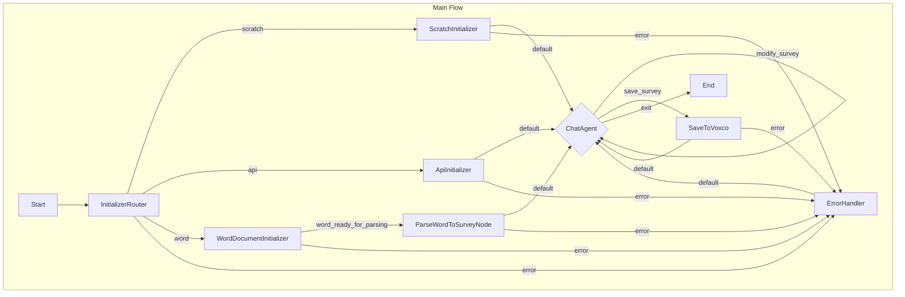

# Design Doc: Your Project Name

> Please DON'T remove notes for AI

## Requirements

> Notes for AI: Keep it simple and clear.
> If the requirements are abstract, write concrete user stories

The primary goal of this system is to act as an AI assistant that collaborates with a user to design and generate a survey questionnaire for the Voxco platform. The final output will be a JSON file conforming to the structure defined in `data/questionnare-schema.json`.

**User Stories:**

1.  **As a user, I want to start designing a survey from scratch**, so I can build a new questionnaire based on my specific needs without any pre-existing structure.
2.  **As a user, I want to import an existing survey from the Voxco platform via its API**, so I can modify a survey that already exists in Voxco.
3.  **As a user, I want to provide a Microsoft Word document containing survey questions and structure**, so the system can automatically generate an initial JSON survey structure based on the document content.
4.  **As a user, I want to interact with the system through a chat interface**, so I can iteratively add, remove, or modify questions, blocks, logic, and other survey elements by giving instructions in natural language.
5.  **As a user, when I am satisfied with the survey design, I want to say "Save"**, so the system will take the generated JSON and import it into the Voxco platform using the appropriate API call.

## Environment Variables and Configuration

The application uses several environment variables for configuration. These can be set directly in the environment or via a `.env` file (loaded using dotenv).

### Required Environment Variables

1. **Google AI API Configuration**
   - `GOOGLE_API_KEY`: API key for accessing Google's Generative AI services
   - `GEMINI_MODEL_NAME`: (Optional) Specific Gemini model to use (defaults to 'gemini-2.5-pro-exp-03-25')

2. **Voxco API Configuration**
   - `VOXCO_API_BASE_URL`: Base URL for the Voxco API (e.g., 'https://beta7.voxco.com')
   - `VOXCO_USERNAME`: (Optional) Username for Voxco API authentication
   - `VOXCO_PASSWORD`: (Optional) Password for Voxco API authentication

If credentials are not provided via environment variables, the application will prompt the user to enter them interactively when needed.

### Configuration Notes

- A warning will be displayed if `GOOGLE_API_KEY` is not set, as LLM calls will fail without it
- The application will use the specified Gemini model or fall back to the default if not specified
- Voxco API credentials can be provided either through environment variables or interactive prompts
- All configuration is loaded at startup using the `dotenv.config()` call

## Flow Design

> Notes for AI:
>
> 1. Consider the design patterns of agent, map-reduce, rag, and workflow. Apply them if they fit.
> 2. Present a concise, high-level description of the workflow.

### Applicable Design Pattern:

-   **Agent**: The core interaction is a chat-based loop where the user iteratively modifies the survey. The AI agent takes user input (chat message) and the current survey state (JSON) as context and decides whether to modify the survey or save it.

### Initial User Choice for Word Import (Pre-Flow Application Logic)

For the "Word document import" option, the application (before starting the main PocketFlow flow) will:
1.  Prompt the user to select the "Word document import" option.
2.  If selected, ask whether the content from the Word document should be imported into:
    *   A **brand new survey** to be created on Voxco (user provides a name).
    *   An **existing survey** to be loaded from Voxco (user provides Survey ID).
    *   A **local scratch survey** (not immediately pushed to Voxco).
3.  Prompt for the path to the Word document.
4.  This information (base choice, Word file path) will be stored in `SharedMemory` (`shared.wordImportBaseDetails`, `shared.initializationSource`) before the `InitializerRouter` node is run.

### Flow high-level Design:

The flow begins with an initializer router that directs the flow based on the initialization type. For 'scratch' or 'api' types, a survey is created or loaded accordingly. For 'word' type, the Word document is read and parsed into a survey structure. After initialization, the flow enters an agentic loop where the user interacts via chat to modify the survey. When the user says "Save", the flow saves the survey to Voxco and returns to the chat agent. The flow only terminates when the user explicitly asks to exit.

1.  **InitializerRouter Node**: Routes to the appropriate initializer based on initialization type.
    * Reads `shared.initializationType` ('scratch', 'api', or 'word')
    * Returns the corresponding action to route to the appropriate initializer

2.  **ScratchInitializer Node**: Creates a new empty survey structure.
    * Creates a minimal valid Questionnaire object
    * Sets `shared.surveyJson` and `shared.activeVoxcoSurveyId = null`
    * Transitions to `ChatAgent`

3.  **ApiInitializer Node**: Imports an existing survey from Voxco API.
    * Authenticates with Voxco API
    * Imports survey using provided survey ID
    * Sets `shared.surveyJson` and `shared.activeVoxcoSurveyId`
    * Transitions to `ChatAgent`

4.  **WordDocumentInitializer Node**: Handles the setup for Word document import.
    * Establishes a base survey based on `shared.wordImportBaseDetails`:
      - For 'new_voxco': Creates a new survey on Voxco
      - For 'api_voxco': Imports existing survey from Voxco
      - For 'local_scratch': Creates a local scratch survey
    * Reads the Word document content
    * Transitions to `ParseWordToSurveyNode`

5.  **ParseWordToSurveyNode**: Processes Word document content into survey structure.
    *   Takes the base survey JSON and the Word document text from shared memory.
    *   Uses an LLM to parse the Word document into logical survey chunks (blocks, questions).
    *   Uses another LLM (iteratively for each chunk) to convert these chunks into JSON Patch operations.
    *   Applies these patches to the survey JSON, validating against the schema after each application.
    *   Transitions to `ChatAgent`.

6.  **ChatAgent Node**: Manages the interactive chat loop.
    -   _Context_: User's chat message, current survey JSON.
    -   _Actions_:
        -   `modify_survey`: Updates the survey JSON based on user instructions.
        -   `save_survey`: Proceeds to the SaveToVoxco node.
        -   `exit`: Terminates the flow.

7.  **SaveToVoxco Node**: Takes the final survey JSON from the shared store and calls the Voxco API utility function to save it.

8.  **ErrorHandler Node**: Processes errors stored in `shared.errorMessage`, informs the user via chat, and returns to the `ChatAgent`.



## Utility Functions

> Notes for AI:
>
> 1. Understand the utility function definition thoroughly by reviewing the doc.
> 2. Include only the necessary utility functions, based on nodes in the flow.

*   **Environment Variable:** The base URL for the Voxco API (e.g., `https://beta7.voxco.com`) should be read from an environment variable like `VOXCO_API_BASE_URL`.

1.  **`callLlm`** (`src/utils/callLlm.ts`)
    -   _Input_: `prompt` (string), potentially `chatHistory` (list of messages)
    -   _Output_: LLM response (string)
    -   _Necessity_: Used by `ChatAgent` node to interpret user commands and modify the survey JSON.

2.  **`voxcoApiAuthenticate`** (`src/utils/voxcoApi.ts`)
    -   _Method_: `GET`
    -   _Endpoint_: `/authentication/user?userInfo.username={username}&userInfo.password={password}` (relative to base URL from env var)
    -   _Input_: Requires user credentials (username, password) from `shared.voxcoCredentials`.
    -   _Output_: JSON object in response body containing user details and an authentication token (e.g., `{"Token": "..."}`). Extracts the `Token` (string) or returns an error.
    -   _Headers_: Requires `Accept: application/json`.
    -   _Necessity_: Must be called *immediately before* any other Voxco API call (`import`, `create`, `save`) to obtain a short-lived token required for subsequent API call authentication.
    -   _Reference_: Authentication flow implied by [Voxco API Docs](https://beta7.voxco.com/api/V1.0/swagger/docs) header requirements and direct API testing.

3.  **`voxcoApiCreateSurvey`** (`src/utils/voxcoApi.ts`)
    -   _Method_: `POST`
    -   _Endpoint_: `/survey/create` (relative to base URL from env var)
    -   _Input_: Survey name (string, e.g., from `shared.surveyJson.Name`), `token` (string obtained from `voxcoApiAuthenticate`).
    -   _Request Body_: JSON object `{ "Name": "{SurveyName}" }` where `{SurveyName}` is the actual survey name.
    -   _Output_: Success status/confirmation (e.g., HTTP 2xx) with a `Location` header containing the URL of the new survey (e.g., `https://.../survey/{surveyId}`). The `surveyId` needs to be parsed from this header. Returns an error on failure.
    -   _Authentication_: Requires `Authorization: Client [token]` header, where `[token]` is the value obtained from `voxcoApiAuthenticate`.
    -   _Headers_: Requires `Content-Type: application/json`, `Accept: application/json`.
    -   _Necessity_: Used by `SaveToVoxco` node *after* successful authentication when saving a survey for the first time (for 'scratch' or 'word' types) to create the survey placeholder and obtain its `surveyId` *before* the first import/save.
    -   _Reference_: [Voxco API Docs](https://beta7.voxco.com/api/V1.0/swagger/docs)

4.  **`voxcoApiImportSurvey`** (`src/utils/voxcoApi.ts`)
    -   _Method_: `GET`
    -   _Endpoint_: `/survey/export/json/{surveyId}` (relative to base URL from env var)
    -   _Input_: `surveyId` (number - obtained via interactive prompt), `token` (string obtained from `voxcoApiAuthenticate`).
    -   _Output_: The survey JSON data is returned **directly in the response body**. The utility parses this JSON string into a `Questionnaire` object. Returns an error on failure or if the response is not valid JSON.
    -   _Authentication_: Requires `Authorization: Client [token]` header.
    -   _Necessity_: Used by `InitializeSurvey` node when `initializationType` is 'api', *after* successful authentication.
    -   _Reference_: [Voxco API Docs](https://beta7.voxco.com/api/V1.0/swagger/docs)

5.  **`voxcoApiSaveSurvey`** (`src/utils/voxcoApi.ts`)
    -   _Endpoint_: `POST /survey/import/json/{surveyId}` (relative to base URL from env var)
    -   _Input_: `surveyJson` (Questionnaire object, needs serialization to JSON string), `surveyId` (number identifying the survey to import into/update - obtained either initially via interactive prompt for 'api' type or dynamically during the save process for new surveys), `token` (string obtained from `voxcoApiAuthenticate`).
    -   _Output_: Success status/confirmation (e.g., HTTP 2xx) or an error.
    -   _Authentication_: Requires `Authorization: Client [token]` header.
    -   _Headers_: Requires `Content-Type: application/json`, `Accept: application/json`.
    -   _Necessity_: Used by `SaveToVoxco` node *after* successful authentication when saving a survey for the first time (for 'scratch' or 'word' types) to create the survey placeholder and obtain its `surveyId` *before* the first import/save.
    -   _Reference_: [Voxco API Docs](https://beta7.voxco.com/api/V1.0/swagger/docs)

6.  **`readWordDocument`** (`src/utils/readWord.ts`)
    -   _Input_: File path (string) or file content (Buffer)
    -   _Output_: Extracted text content (string) or a structured representation (object) of the document.
    -   _Necessity_: Used by `InitializeSurvey` node when `initializationType` is 'word'.

7.  **`fast-json-patch`** (External library)
    -   _Description_: A library that implements RFC 6902 JSON Patch operations for precise modifications to JSON objects.
    -   _Input_: 
        - `applyPatch(document, patches)`: Takes a target document and an array of patch operations
        - `Operation` type: Defines the structure of JSON patch operations (add, remove, replace, etc.)
    -   _Output_: Modified document after applying all patch operations
    -   _Necessity_: Used by the `ChatAgent` node to apply structured modifications to the survey JSON based on LLM-generated patch operations.
    -   _Reference_: [RFC 6902](https://datatracker.ietf.org/doc/html/rfc6902) (JSON Patch standard)

8.  **Schema Validation with Ajv** (External library)
    -   _Description_: A JSON Schema validator used to ensure the survey structure conforms to the defined schema in `data/questionnare-schema.json`.
    -   _Input_: 
        - JSON object to validate (the survey structure)
        - Schema definition (loaded from `data/questionnare-schema.json`)
    -   _Output_: 
        - Boolean validation result
        - Error objects containing detailed validation errors if validation fails
    -   _Setup_:
        ```typescript
        const ajv = new Ajv({ allErrors: true });
        addFormats(ajv); // Adds format validations (email, date-time, etc.)
        const validateSchema = ajv.compile(questionnaireSchema);
        ```
    -   _Usage_:
        ```typescript
        const isValid = validateSchema(surveyJson);
        if (!isValid) {
          console.error("Validation errors:", validateSchema.errors);
          // Handle validation failure
        }
        ```
    -   _Necessity_: Used in the `ChatAgent` node to validate survey JSON after applying LLM-generated patches, ensuring the structure remains valid according to the Voxco questionnaire schema.
    -   _Reference_: [Ajv Documentation](https://ajv.js.org/)

## Node Design

### Shared Memory

> Notes for AI: Try to minimize data redundancy

*   **Startup Configuration:** Before the flow starts, the application (running in the console) will interactively prompt the user to determine the `initializationType` ('scratch', 'api', 'word'). Based on this, it will prompt for the necessary `initializationSource` (survey ID for 'api', file path for 'word') and the `voxcoCredentials` (username and password). **Note:** While interactive prompts are used here for simplicity in the console version, a production system should use a more secure method like environment variables (`VOXCO_USERNAME`, `VOXCO_PASSWORD`) for credentials. This initial data will be used to populate the `SharedMemory` before running the `InitializerRouter` node.

The shared memory structure will hold the state needed across the nodes. Its structure is based on the flow requirements and the `data/questionnare-schema.json` for the survey object itself.

```typescript
// Represents the structure defined in data/questionnare-schema.json
// It's complex, so we define it conceptually here with its top-level keys.
// For detailed sub-structures (like Settings, Blocks, Questions, etc.), 
// refer directly to the data/questionnare-schema.json file.
interface Questionnaire {
  _v?: string; // Schema version
  _d?: string; // Modification date
  id?: number | null; // Survey ID (use `id` instead of `Id`)
  name?: string | null; // Survey name (use `name` instead of `Name`)
  version?: number; // Survey version (use `version` instead of `Version`)
  useS2?: boolean;
  settings?: Record<string, any>; // Global survey settings object
  languages?: string[]; // Array of language codes
  defaultLanguage?: string | null;
  blocks?: any[]; // Array of Block objects
  choiceLists?: any[]; // Array of ChoiceList arrays
  questionStyles?: any[]; // Array of custom styles
  shortcuts?: any[]; // Array of shortcuts
  randomizations?: any[]; // Array of global randomizations
  columns?: Record<string, any>; // Column definitions object
  surveyProperties?: Record<string, any>; // Additional survey properties
  translatedTexts?: Record<string, Record<string, string>>; // System messages translations
  theme?: Record<string, any>; // Theme object
}

interface ChatMessage {
  role: 'user' | 'assistant';
  content: string;
}

interface SharedMemory {
  // --- Initialization Data --- 
  initializationType: 'scratch' | 'api' | 'word' | null;
  initializationSource?: string | Buffer | number | null; // e.g., surveyId for API, filePath/content for Word
  voxcoCredentials?: { username: string, password: string }; // Raw credentials obtained via prompt (console) or env vars (production)
  // NEW: Details for how to establish the base survey for Word import
  wordImportBaseDetails?: { 
    type: 'new_voxco', 
    surveyName: string // Name for the new survey on Voxco
  } | { 
    type: 'api_voxco', 
    surveyId: number 
  } | { 
    type: 'local_scratch' 
  };
  // NEW: To store the text content of the Word document
  wordDocumentText?: string | null;

  // --- Core Survey Data --- 
  surveyJson?: Questionnaire | null; // The main survey object being built/modified. Its 'id' field will store the Voxco Survey ID if applicable.
  // NEW: Authoritative Survey ID for Voxco operations
  activeVoxcoSurveyId?: number | null; // Stores the Voxco Survey ID if the survey exists on the platform, otherwise null.

  // --- Chat Agent State --- 
  currentUserMessage?: string | null; // The latest message from the user

  // --- Output State --- 
  saveStatus?: boolean | string | null; // Result from SaveToVoxco node
  errorMessage?: string | null; // To store any errors encountered
}
```

### Node Steps

> Notes for AI: Carefully decide whether to use Batch/Node/Flow. Use regular Nodes unless batch processing is explicitly needed.

1.  **InitializerRouter Node**

    * _Purpose_: To examine the initialization type and route to the appropriate initializer node.
    * _Type_: Node
    * _Steps_:
        * `prep(shared: SharedMemory)`:
            * Validate that `initializationType` is set in shared memory
            * Return the initialization type
        * `exec(initializationType: 'scratch' | 'api' | 'word')`:
            * Simply return the initialization type (no processing needed)
        * `post(shared: SharedMemory, prepRes, execRes: string)`:
            * Return the initialization type as the action for routing

2.  **ScratchInitializer Node**

    * _Purpose_: To create a minimal valid survey structure from scratch.
    * _Type_: Node
    * _Steps_:
        * `prep(shared: SharedMemory)`:
            * No real prep needed, just validate shared memory is available
            * Return an empty object or null
        * `exec(prepRes)`:
            * Create a minimal valid `Questionnaire` object with standard defaults:
                * `id: null`
                * Default name "New Survey from Bot"
                * Default version 1
                * Default language "en"
                * Empty blocks array
                * Empty choiceLists array
                * Basic translatedTexts with English
            * Return this new `Questionnaire`
        * `post(shared: SharedMemory, prepRes, execRes: Questionnaire | Error)`:
            * If `execRes` is an Error: Store error in `shared.errorMessage`. Return `"error"` action.
            * Otherwise: Store `execRes` in `shared.surveyJson`, set `shared.activeVoxcoSurveyId` to `null`, and return `"default"` action.

3.  **ApiInitializer Node**

    * _Purpose_: To import an existing survey from the Voxco platform via its API.
    * _Type_: Node
    * _Steps_:
        * `prep(shared: SharedMemory)`:
            * Validate that `initializationSource` (surveyId) exists
            * Validate that `voxcoCredentials` exists
            * Return these values as a structured object
        * `exec(prepRes: { source: number, credentials: { username: string, password: string } })`:
            * Call `voxcoApiAuthenticate` using `prepRes.credentials` to get a token
            * Call `voxcoApiImportSurvey` with `prepRes.source` (surveyId) and the token
            * Return the imported `Questionnaire`
        * `post(shared: SharedMemory, prepRes, execRes: Questionnaire | Error)`:
            * If `execRes` is an Error: Store error in `shared.errorMessage`. Return `"error"` action.
            * Otherwise:
                * Store `execRes` in `shared.surveyJson`
                * Set `shared.activeVoxcoSurveyId` to the imported surveyId
                * Return `"default"` action

4.  **WordDocumentInitializer Node**

    * _Purpose_: To set up a base survey and read a Word document for subsequent parsing.
    * _Type_: Node
    * _Steps_:
        * `prep(shared: SharedMemory)`:
            * Validate that `initializationSource` (Word file path) exists
            * Validate that `wordImportBaseDetails` exists
            * For 'new_voxco' or 'api_voxco' types, validate that `voxcoCredentials` exists
            * Return these values as a structured object
        * `exec(prepRes)`:
            * **Establish Base Survey**:
                * If `prepRes.wordImportBaseDetails.type === 'new_voxco'`:
                    * Call `voxcoApiAuthenticate` utility using credentials
                    * Call `voxcoApiCreateSurvey` utility (with surveyName and token)
                    * Store the new survey ID in a class property
                    * Create a minimal `Questionnaire` object
                * If `prepRes.wordImportBaseDetails.type === 'api_voxco'`:
                    * Call `voxcoApiAuthenticate` utility using credentials
                    * Call `voxcoApiImportSurvey` utility (with surveyId and token)
                    * Store the surveyId in a class property
                * If `prepRes.wordImportBaseDetails.type === 'local_scratch'`:
                    * Create a minimal valid `Questionnaire` object
            * **Read Word Document**:
                * Call `readWordDocument` utility with the file path/content
            * Return `{ baseSurvey: baseSurveyJson, textFromWord: wordText }`
        * `post(shared: SharedMemory, prepRes, execRes: { baseSurvey: Questionnaire, textFromWord: string } | Error)`:
            * If `execRes` is an Error: Store error in `shared.errorMessage`. Return `"error"` action.
            * Otherwise:
                * Store `execRes.baseSurvey` in `shared.surveyJson`
                * Store `execRes.textFromWord` in `shared.wordDocumentText`
                * Set `shared.activeVoxcoSurveyId` based on the wordImportBaseDetails type
                * Return `"word_ready_for_parsing"` action

5.  **ParseWordToSurveyNode**

    * _Purpose_: To take the base `surveyJson` and `wordDocumentText` from shared memory, use LLMs to parse the Word document, and apply its content as modifications to the `surveyJson`.
    * _Type_: Node
    * _Steps_:
        * `prep(shared: SharedMemory)`: 
            * Validate that `shared.surveyJson` and `shared.wordDocumentText` exist
            * Return both as a structured object
        * `exec(prepRes: { baseSurvey: Questionnaire, wordText: string })`:
            * **Step 1**: Use LLM to parse the Word document into structured chunks:
                * Call `callLlm` with a prompt to analyze the Word text and separate it into logical chunks (blocks, questions)
                * Parse the LLM response into an array of chunk objects
            * **Step 2**: For each chunk, use LLM to generate JSON Patch operations:
                * Call `callLlm` with a prompt that includes the current survey state, schema, and the chunk to process
                * Parse the response into JSON Patch operations
                * Apply the patch to the current survey state
                * Validate the patched survey against the schema
                * If valid, update the current survey state; otherwise, log the error and continue
            * Return the final processed survey
        * `post(shared: SharedMemory, prepRes, execRes: Questionnaire | Error)`:
            * If `execRes` is an Error: Store error in `shared.errorMessage`. Return `"error"` action.
            * Otherwise:
                * Update `shared.surveyJson` with `execRes`
                * Clear `shared.wordDocumentText` as it's been processed
                * Add a helpful message to `shared.currentUserMessage`
                * Return `"default"` action to proceed to ChatAgent

6.  **ChatAgent Node**

    * _Purpose_: To manage the iterative chat interaction with the user, modifying the survey based on their instructions.
    * _Type_: Node
    * _Steps_:
        * `prep(shared: SharedMemory)`: 
            * Read `shared.currentUserMessage` and `shared.surveyJson`. 
            * Prepare a concise context for the LLM.
        * `exec(prepRes)`: 
            * Check for simple commands (save, exit) before calling the LLM
            * For complex requests, call `callLlm` with a prompt to:
                1. Analyze the user message
                2. Determine the user's intent (modify, save, exit, display info)
                3. For modifications, generate JSON Patch operations
                4. Return a structured response with action and data
        * `post(shared: SharedMemory, prepRes, execRes: { action: string, patch?: any[], content?: string })`: 
            * Based on `execRes.action`:
                * If `modify_survey`:
                    1. Validate and apply the patch to `shared.surveyJson`
                    2. Validate the result against the schema
                    3. Update `shared.surveyJson` if valid
                    4. Return `"modify_survey"` action
                * If `save_survey`: Return `"save_survey"` action
                * If `exit`: Return `"exit"` action
                * If `display_response`: 
                    1. Print the content to the console
                    2. Return `"modify_survey"` action
                * On errors: Store error in `shared.errorMessage`, return `"error"` action

7.  **SaveToVoxco Node**

    * _Purpose_: To save the final survey design to the Voxco platform using the API.
    * _Type_: Node
    * _Steps_:
        * `prep(shared: SharedMemory)`: 
            * Read `shared.surveyJson`, `shared.voxcoCredentials`, and `shared.activeVoxcoSurveyId`
            * Return these values as a structured object
        * `exec(prepRes: { surveyJson: Questionnaire, credentials: object, activeVoxcoSurveyId: number | null })`:
            * Call `voxcoApiAuthenticate` using credentials to get a fresh token
            * If `activeVoxcoSurveyId` is null:
                * Call `voxcoApiCreateSurvey` to create a new survey
                * Call `voxcoApiSaveSurvey` with the new ID and survey content
            * Otherwise:
                * Call `voxcoApiSaveSurvey` with the existing ID and survey content
            * Return the survey ID (new or existing)
        * `post(shared: SharedMemory, prepRes, execRes: number | Error)`:
            * If `execRes` is an Error: Store error in `shared.errorMessage`. Return `"error"` action.
            * Otherwise: 
                * Update `shared.activeVoxcoSurveyId` if it was null
                * Set `shared.saveStatus` to "success"
                * Return `"default"` action

8.  **ErrorHandler Node**

    * _Purpose_: To process errors stored in `shared.errorMessage`, inform the user, and return to the `ChatAgent`.
    * _Type_: Node
    * _Steps_:
        * `prep(shared: SharedMemory)`: Read `shared.errorMessage`
        * `exec(errorMessage: string)`: Format and display the error to the user
        * `post(shared: SharedMemory, prepRes, execRes)`:
            * Clear `shared.errorMessage`
            * Return `"default"` action (transitions back to `ChatAgent`)