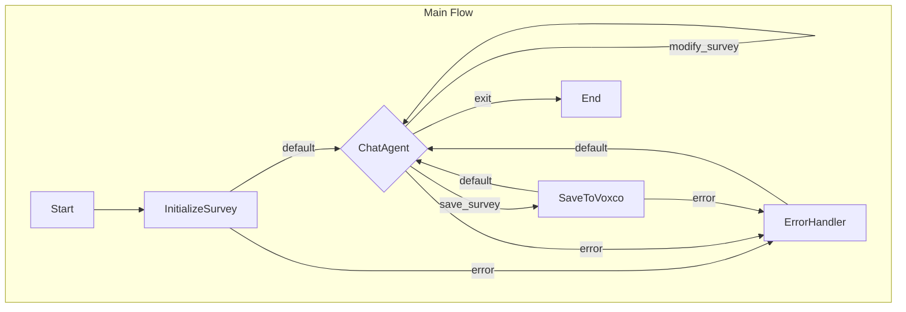

# Design Doc: Your Project Name

> Please DON'T remove notes for AI

## Requirements

> Notes for AI: Keep it simple and clear.
> If the requirements are abstract, write concrete user stories

The primary goal of this system is to act as an AI assistant that collaborates with a user to design and generate a survey questionnaire for the Voxco platform. The final output will be a JSON file conforming to the structure defined in `data/questionnare-schema.json`.

**User Stories:**

1.  **As a user, I want to start designing a survey from scratch**, so I can build a new questionnaire based on my specific needs without any pre-existing structure.
2.  **As a user, I want to import an existing survey from the Voxco platform via its API**, so I can modify a survey that already exists in Voxco.
3.  **As a user, I want to provide a Microsoft Word document containing survey questions and structure**, so the system can automatically generate an initial JSON survey structure based on the document content.
4.  **As a user, I want to interact with the system through a chat interface**, so I can iteratively add, remove, or modify questions, blocks, logic, and other survey elements by giving instructions in natural language.
5.  **As a user, when I am satisfied with the survey design, I want to say "Save"**, so the system will take the generated JSON and import it into the Voxco platform using the appropriate API call.

## Environment Variables and Configuration

The application uses several environment variables for configuration. These can be set directly in the environment or via a `.env` file (loaded using dotenv).

### Required Environment Variables

1. **Google AI API Configuration**
   - `GOOGLE_API_KEY`: API key for accessing Google's Generative AI services
   - `GEMINI_MODEL_NAME`: (Optional) Specific Gemini model to use (defaults to 'gemini-2.5-pro-exp-03-25')

2. **Voxco API Configuration**
   - `VOXCO_API_BASE_URL`: Base URL for the Voxco API (e.g., 'https://beta7.voxco.com')
   - `VOXCO_USERNAME`: (Optional) Username for Voxco API authentication
   - `VOXCO_PASSWORD`: (Optional) Password for Voxco API authentication

If credentials are not provided via environment variables, the application will prompt the user to enter them interactively when needed.

### Configuration Notes

- A warning will be displayed if `GOOGLE_API_KEY` is not set, as LLM calls will fail without it
- The application will use the specified Gemini model or fall back to the default if not specified
- Voxco API credentials can be provided either through environment variables or interactive prompts
- All configuration is loaded at startup using the `dotenv.config()` call

## Flow Design

> Notes for AI:
>
> 1. Consider the design patterns of agent, map-reduce, rag, and workflow. Apply them if they fit.
> 2. Present a concise, high-level description of the workflow.

### Applicable Design Pattern:

-   **Agent**: The core interaction is a chat-based loop where the user iteratively modifies the survey. The AI agent takes user input (chat message) and the current survey state (JSON) as context and decides whether to modify the survey or save it.

### Flow high-level Design:

The flow starts by initializing the survey based on user input (scratch, API import, or Word doc). Then, it enters an agentic loop where the user interacts via chat to modify the survey structure held in the shared store. When the user indicates they want to save (e.g., says "Save"), the flow proceeds to save the current survey JSON to the Voxco platform via an API call and then returns to the chat agent for further modifications. The flow only terminates when the user explicitly asks to exit.

1.  **InitializeSurvey Node**: Determines the starting point (scratch, API import, Word doc) and prepares the initial survey JSON in the shared store.
2.  **ChatAgent Node**: Manages the interactive chat loop.
        -   _Context_: User's chat message, current survey JSON. (Note: Chat history passed to the LLM in `exec` should be managed to stay concise, e.g., by clearing it in `post` after each successful modification).
    -   _Actions_:
        -   `modify_survey`: Updates the survey JSON based on user instructions. **Crucially, the node should clear/reset the chat history in the shared store before looping back via this action.** This ensures the next iteration starts fresh, keeping the context passed to the LLM small.
        -   `save_survey`: Proceeds to the SaveToVoxco node.
        -   `exit`: Terminates the flow.
3.  **SaveToVoxco Node**: Takes the final survey JSON from the shared store and calls the Voxco API utility function to save it.
4.  **ErrorHandler Node**: Processes errors stored in `shared.errorMessage`, informs the user via chat, and returns to the `ChatAgent`.



## Utility Functions

> Notes for AI:
>
> 1. Understand the utility function definition thoroughly by reviewing the doc.
> 2. Include only the necessary utility functions, based on nodes in the flow.

*   **Environment Variable:** The base URL for the Voxco API (e.g., `https://beta7.voxco.com`) should be read from an environment variable like `VOXCO_API_BASE_URL`.

1.  **`callLlm`** (`src/utils/callLlm.ts`)
    -   _Input_: `prompt` (string), potentially `chatHistory` (list of messages)
    -   _Output_: LLM response (string)
    -   _Necessity_: Used by `ChatAgent` node to interpret user commands and modify the survey JSON.

2.  **`voxcoApiAuthenticate`** (`src/utils/voxcoApi.ts`)
    -   _Method_: `GET`
    -   _Endpoint_: `/authentication/user?userInfo.username={username}&userInfo.password={password}` (relative to base URL from env var)
    -   _Input_: Requires user credentials (username, password) from `shared.voxcoCredentials`.
    -   _Output_: JSON object in response body containing user details and an authentication token (e.g., `{"Token": "..."}`). Extracts the `Token` (string) or returns an error.
    -   _Headers_: Requires `Accept: application/json`.
    -   _Necessity_: Must be called *immediately before* any other Voxco API call (`import`, `create`, `save`) to obtain a short-lived token required for subsequent API call authentication.
    -   _Reference_: Authentication flow implied by [Voxco API Docs](https://beta7.voxco.com/api/V1.0/swagger/docs) header requirements and direct API testing.

3.  **`voxcoApiCreateSurvey`** (`src/utils/voxcoApi.ts`)
    -   _Method_: `POST`
    -   _Endpoint_: `/survey/create` (relative to base URL from env var)
    -   _Input_: Survey name (string, e.g., from `shared.surveyJson.Name`), `token` (string obtained from `voxcoApiAuthenticate`).
    -   _Request Body_: JSON object `{ "Name": "{SurveyName}" }` where `{SurveyName}` is the actual survey name.
    -   _Output_: Success status/confirmation (e.g., HTTP 2xx) with a `Location` header containing the URL of the new survey (e.g., `https://.../survey/{surveyId}`). The `surveyId` needs to be parsed from this header. Returns an error on failure.
    -   _Authentication_: Requires `Authorization: Client [token]` header, where `[token]` is the value obtained from `voxcoApiAuthenticate`.
    -   _Headers_: Requires `Content-Type: application/json`, `Accept: application/json`.
    -   _Necessity_: Used by `SaveToVoxco` node *after* successful authentication when saving a survey for the first time (for 'scratch' or 'word' types) to create the survey placeholder and obtain its `surveyId` *before* the first import/save.
    -   _Reference_: [Voxco API Docs](https://beta7.voxco.com/api/V1.0/swagger/docs)

4.  **`voxcoApiImportSurvey`** (`src/utils/voxcoApi.ts`)
    -   _Method_: `GET`
    -   _Endpoint_: `/survey/export/json/{surveyId}` (relative to base URL from env var)
    -   _Input_: `surveyId` (number - obtained via interactive prompt), `token` (string obtained from `voxcoApiAuthenticate`).
    -   _Output_: The survey JSON data is returned **directly in the response body**. The utility parses this JSON string into a `Questionnaire` object. Returns an error on failure or if the response is not valid JSON.
    -   _Authentication_: Requires `Authorization: Client [token]` header.
    -   _Necessity_: Used by `InitializeSurvey` node when `initializationType` is 'api', *after* successful authentication.
    -   _Reference_: [Voxco API Docs](https://beta7.voxco.com/api/V1.0/swagger/docs)

5.  **`voxcoApiSaveSurvey`** (`src/utils/voxcoApi.ts`)
    -   _Endpoint_: `POST /survey/import/json/{surveyId}` (relative to base URL from env var)
    -   _Input_: `surveyJson` (Questionnaire object, needs serialization to JSON string), `surveyId` (number identifying the survey to import into/update - obtained either initially via interactive prompt for 'api' type or dynamically during the save process for new surveys), `token` (string obtained from `voxcoApiAuthenticate`).
    -   _Output_: Success status/confirmation (e.g., HTTP 2xx) or an error.
    -   _Authentication_: Requires `Authorization: Client [token]` header.
    -   _Headers_: Requires `Content-Type: application/json`, `Accept: application/json`.
    -   _Necessity_: Used by `SaveToVoxco` node *after* successful authentication when saving a survey for the first time (for 'scratch' or 'word' types) to create the survey placeholder and obtain its `surveyId` *before* the first import/save.
    -   _Reference_: [Voxco API Docs](https://beta7.voxco.com/api/V1.0/swagger/docs)

6.  **`readWordDocument`** (`src/utils/readWord.ts`)
    -   _Input_: File path (string) or file content (Buffer)
    -   _Output_: Extracted text content (string) or a structured representation (object) of the document.
    -   _Necessity_: Used by `InitializeSurvey` node when `initializationType` is 'word'.

7.  **`fast-json-patch`** (External library)
    -   _Description_: A library that implements RFC 6902 JSON Patch operations for precise modifications to JSON objects.
    -   _Input_: 
        - `applyPatch(document, patches)`: Takes a target document and an array of patch operations
        - `Operation` type: Defines the structure of JSON patch operations (add, remove, replace, etc.)
    -   _Output_: Modified document after applying all patch operations
    -   _Necessity_: Used by the `ChatAgent` node to apply structured modifications to the survey JSON based on LLM-generated patch operations.
    -   _Reference_: [RFC 6902](https://datatracker.ietf.org/doc/html/rfc6902) (JSON Patch standard)

8.  **Schema Validation with Ajv** (External library)
    -   _Description_: A JSON Schema validator used to ensure the survey structure conforms to the defined schema in `data/questionnare-schema.json`.
    -   _Input_: 
        - JSON object to validate (the survey structure)
        - Schema definition (loaded from `data/questionnare-schema.json`)
    -   _Output_: 
        - Boolean validation result
        - Error objects containing detailed validation errors if validation fails
    -   _Setup_:
        ```typescript
        const ajv = new Ajv({ allErrors: true });
        addFormats(ajv); // Adds format validations (email, date-time, etc.)
        const validateSchema = ajv.compile(questionnaireSchema);
        ```
    -   _Usage_:
        ```typescript
        const isValid = validateSchema(surveyJson);
        if (!isValid) {
          console.error("Validation errors:", validateSchema.errors);
          // Handle validation failure
        }
        ```
    -   _Necessity_: Used in the `ChatAgent` node to validate survey JSON after applying LLM-generated patches, ensuring the structure remains valid according to the Voxco questionnaire schema.
    -   _Reference_: [Ajv Documentation](https://ajv.js.org/)

## Node Design

### Shared Memory

> Notes for AI: Try to minimize data redundancy

*   **Startup Configuration:** Before the flow starts, the application (running in the console) will interactively prompt the user to determine the `initializationType` ('scratch', 'api', 'word'). Based on this, it will prompt for the necessary `initializationSource` (survey ID for 'api', file path for 'word') and the `voxcoCredentials` (username and password). **Note:** While interactive prompts are used here for simplicity in the console version, a production system should use a more secure method like environment variables (`VOXCO_USERNAME`, `VOXCO_PASSWORD`) for credentials. This initial data will be used to populate the `SharedMemory` before running the `InitializeSurvey` node.

The shared memory structure will hold the state needed across the nodes. Its structure is based on the flow requirements and the `data/questionnare-schema.json` for the survey object itself.

```typescript
// Represents the structure defined in data/questionnare-schema.json
// It's complex, so we define it conceptually here with its top-level keys.
// For detailed sub-structures (like Settings, Blocks, Questions, etc.), 
// refer directly to the data/questionnare-schema.json file.
interface Questionnaire {
  _v?: string; // Schema version
  _d?: string; // Modification date
  id?: number | null; // Survey ID (use `id` instead of `Id`)
  name?: string | null; // Survey name (use `name` instead of `Name`)
  version?: number; // Survey version (use `version` instead of `Version`)
  useS2?: boolean;
  settings?: Record<string, any>; // Global survey settings object
  languages?: string[]; // Array of language codes
  defaultLanguage?: string | null;
  blocks?: any[]; // Array of Block objects
  choiceLists?: any[]; // Array of ChoiceList arrays
  questionStyles?: any[]; // Array of custom styles
  shortcuts?: any[]; // Array of shortcuts
  randomizations?: any[]; // Array of global randomizations
  columns?: Record<string, any>; // Column definitions object
  surveyProperties?: Record<string, any>; // Additional survey properties
  translatedTexts?: Record<string, Record<string, string>>; // System messages translations
  theme?: Record<string, any>; // Theme object
}

interface ChatMessage {
  role: 'user' | 'assistant';
  content: string;
}

interface SharedMemory {
  // --- Initialization Data --- 
  initializationType: 'scratch' | 'api' | 'word' | null;
  initializationSource?: string | Buffer | number | null; // e.g., surveyId for API, filePath/content for Word
  voxcoCredentials?: { username: string, password: string }; // Raw credentials obtained via prompt (console) or env vars (production)

  // --- Core Survey Data --- 
  surveyJson?: Questionnaire | null; // The main survey object being built/modified

  // --- Chat Agent State --- 
  currentUserMessage?: string | null; // The latest message from the user

  // --- Output State --- 
  saveStatus?: boolean | string | null; // Result from SaveToVoxco node
  errorMessage?: string | null; // To store any errors encountered
}
```

### Node Steps

> Notes for AI: Carefully decide whether to use Batch/Node/Flow. Use regular Nodes unless batch processing is explicitly needed.

1.  **InitializeSurvey Node**

    *   _Purpose_: To create the initial `surveyJson` in the `SharedMemory` based on the user's chosen method (scratch, API import, or Word doc).
    *   _Type_: Node
    *   _Steps_:
        *   `prep(shared: SharedMemory)`: 
            * Validate that `initializationType` is set in shared memory
            * For 'api' and 'word' types, confirm `initializationSource` is provided
            * For 'api' type, ensure `voxcoCredentials` exists
            * Return initialization parameters as a structured object
        *   `exec(prepRes)`: Perform the initialization based on `initializationType`:
            *   If 'scratch': Create a minimal valid `Questionnaire` object with standard defaults (null ID, English language, empty blocks array, etc.)
            *   If 'api': 
                1. Call `voxcoApiAuthenticate` using `voxcoCredentials` to get a token.
                2. Call `voxcoApiImportSurvey` utility function with `initializationSource` (surveyId) and the obtained token.
                3. Log confirmation of successful import
            *   If 'word': 
                1. Call the `readWordDocument` utility function with `initializationSource` (file path/content)
                2. Use `callLlmStream` to convert the extracted text into a JSON structure
                3. Process the LLM response:
                   - Strip markdown fences if present
                   - Parse the JSON structure
                   - Validate it contains required fields
                   - Set ID to null and provide default name if needed
                4. If JSON parsing fails:
                   - Save the raw LLM response to a file for debugging
                   - Throw a detailed error message
            *   All errors are caught and returned from exec for handling in post
        *   `post(shared: SharedMemory, prepRes, execRes: Questionnaire | Error)`: 
            *   If `execRes` is an Error: Store error details in `shared.errorMessage`. Return `"error"` action.
            *   If `execRes` is a valid `Questionnaire`: 
               * Write it to `shared.surveyJson`
               * Clear any previous errors
               * For API imports, store the Voxco Survey ID in shared memory
               * For other types, set Voxco Survey ID to null
               * Return `"default"` action to proceed to ChatAgent

2.  **ChatAgent Node**

    *   _Purpose_: To manage the iterative chat interaction with the user, modifying the survey based on their instructions.
    *   _Type_: Node
    *   _Steps_:
        *   `prep(shared: SharedMemory)`: Read `shared.currentUserMessage` and `shared.surveyJson`. Prepare a concise context for the LLM (current message + potentially a summary or key parts of the survey JSON, not necessarily the whole thing).
        *   `exec(prepRes)`: Call the `callLlm` utility function with the prepared context and a prompt instructing it to:
            1.  Analyze the user message (`currentUserMessage`).
            2.  Determine the user's intent (modify survey, save, exit).
            3.  If modifying, generate a **JSON Patch operation** (see RFC 6902) representing the requested change to the survey JSON.
            4.  If the user asks to see the structure or asks a question about it, generate a text response.
            5.  Output a structured response indicating the action (`modify_survey`, `save_survey`, `exit`, `display_response`) and the corresponding data (patch operation for `modify_survey`, text content for `display_response`). Example output structure: `{ action: 'modify_survey', patch: [...] }` or `{ action: 'display_response', content: '...' }`.
        *   `post(shared: SharedMemory, prepRes, execRes: { action: string, patch?: any[], content?: string })`: 
            *   Based on `execRes.action`:
                *   If `modify_survey`:
                    1. Validate the received `execRes.patch` format.
                    2. **Attempt to apply the `execRes.patch` to the current `shared.surveyJson`.**
                    3. **Validate the _resulting* survey JSON against the schema defined in `data/questionnare-schema.json`.** This ensures the survey remains valid after the patch.
                    4. If patch application and schema validation are successful: Update `shared.surveyJson` with the patched version. 
                    5. **Crucially, print a confirmation message to the console (e.g., "Survey updated successfully.").**
                    6. If patch application or validation fails: Do not update `shared.surveyJson`. Store a relevant error (invalid patch, invalid result) in `shared.errorMessage`. (Consider adding a message back to the user via chat history indicating the failure).
                    7. Return the `modify_survey` action (loops back).
                *   If `save_survey`: Return the `save_survey` action.
                *   If `exit`: Return the `exit` action.
                *   If `display_response`:
                    1. Print `execRes.content` to the console.
                    2. Return the `modify_survey` action (loops back).
                *   If an error occurred during `exec` (e.g., LLM call failure): Store the error in `shared.errorMessage`. Return `"error"` action.

3.  **SaveToVoxco Node**

    *   _Purpose_: To save the final survey design to the Voxco platform using the API. Handles both creating new surveys on Voxco and updating existing ones.
    *   _Type_: Node
    *   _Steps_:
        *   `prep(shared: SharedMemory)`: Read `shared.surveyJson` and `shared.voxcoCredentials` (or token if stored).
        *   `exec(prepRes)`: 
            1. Check if `shared.surveyJson.id` is `null`.
            2. Call `voxcoApiAuthenticate` using `voxcoCredentials` to get a fresh token.
            3. If `shared.surveyJson.id` is `null` (first save for new survey):
                a. Call `voxcoApiCreateSurvey` using a name from `shared.surveyJson.name` (or a default) and the obtained token.
                b. Parse the new `surveyId` from the response's `Location` header.
                c. Update `shared.surveyJson.id` with this new `surveyId`.
                d. Call `voxcoApiSaveSurvey` using the *new* `surveyId`, the `shared.surveyJson` content, and the obtained token.
            4. If `shared.surveyJson.id` has a value (updating existing survey):
                a. Call `voxcoApiSaveSurvey` using the existing `shared.surveyJson.id`, the `shared.surveyJson` content, and the obtained token.
            5. Return the success status or error from the save/create+save operation.
        *   `post(shared: SharedMemory, prepRes, execRes: boolean | string | Error)`: 
            *   If `execRes` indicates an error: Store error details in `shared.errorMessage`. Return `"error"` action.
            *   If `execRes` indicates success: Write success status to `shared.saveStatus`. Return `"default"` action.

4.  **ErrorHandler Node**

    *   _Purpose_: To process errors stored in `shared.errorMessage`, inform the user via chat, and return control to the `ChatAgent`.
    *   _Type_: Node
    *   _Steps_:
        *   `prep(shared: SharedMemory)`: Read `shared.errorMessage`.
        *   `exec(errorMessage: string)`: Format the error message for user display (e.g., simplify technical details), **print it to the console**, and log the full error if needed.
        *   `post(shared: SharedMemory, prepRes, execRes: string)`:
            *   Clear `shared.errorMessage`.
            *   Return `"default"` action (transitions back to `ChatAgent`).
